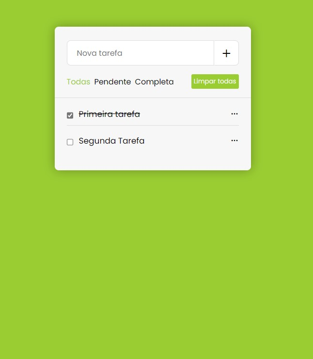

# **ToDoApp **

    

## ✨ Sobre
  O **todoApp** é uma simples aplicação web de lista de tarefas.  
  Feito com o intuito de ajudar na organização e produtividade do dia a dia.

## 🙌 Motivação
<ul>
  <li>Colocar os aprendizados que tenho adquirido durante o curso na <b style="color: yellow">Resilia Educação</b></li>
  <li>Reforçar os conceitos de manipulação do <b style="color: brown">DOM</b> com javascript</li>
  <li>Aprender a utilizar o <b style="color: orange">localStorage</b> para armazenar no browser as tarefas do usuário</li>
</ul>
  

## ⚙️ Funcionalidades

- [➕] Adicionar
- [✍️] Editar 
- [❌] Deletar 
- [✅] Marcar como concluída
- [⚙️] Filtrar por concluídas ou pendentes
- [😿] Excluir todas as tarefas

## 🚀 Tecnologias

Desenvolvido com as seguintes tecnologias:

- HTML
- CSS
- Javascript 

## ✅ Projeto

Link: https://lucasmedeiros7.github.io/todoApp/

**Feito com 💖 by Lucas Medeiros**
